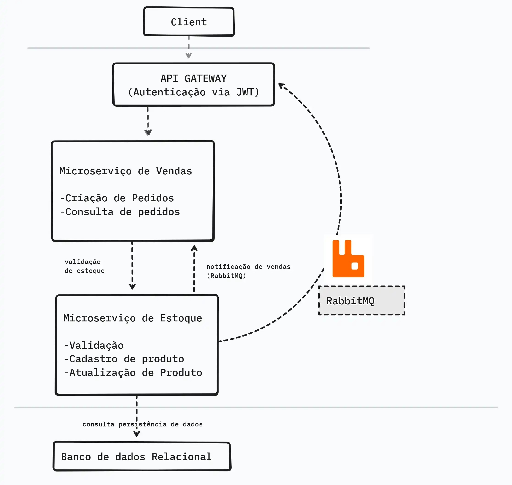

# Ecommerce Microservices - Desafio Avanade

Projeto para desenvolver uma aplicação com arquitetura de microserviços para gerenciamento de estoque de produtos e vendas em uma plataforma de e-commerce.

O sistema é composto por microserviços que se comunicam via um API Gateway e um broker de mensagens (RabbitMQ). A autenticação é baseada em JWT.

[](https://github.com/miguelxl123/ecommerce-desafio-avanade)


# Arquitetura

- **API Gateway** (Porta 5000) - Roteamento e autenticação JWT
- **Microserviço Vendas** (Porta 5001) - Gestão de pedidos
- **Microserviço Estoque** (Porta 5002) - Gestão de produtos
- **PostgreSQL** - Banco de dados com schemas separados
- **RabbitMQ** - Mensageria assíncrona
- **Docker** - Orquestração dos serviços

## 🏗️ Arquitetura do Sistema



*Diagrama da arquitetura de microserviços do sistema de ecommerce*

##  Tecnologias

-  
-  
- Entity Framework Core
-  
-  
-  
- YARP (API Gateway) 
-  
-  
-  

##  Execução

### **Iniciar Sistema:**
```bash
docker-compose up -d
```

### **Teste Automatizado:**
```powershell
.\test-quick.ps1
```

### **Acessos:**
- **API Gateway:** http://localhost:5000/swagger
- **Vendas:** http://localhost:5001/swagger  
- **Estoque:** http://localhost:5002/swagger
- **RabbitMQ:** http://localhost:15672 (admin/admin123)

##  Documentação

- **Testes:** [](./MANUAL-TESTES.md)
- **Setup:** [](./SETUP.md)
- **Postman:** [](./postman-collection.json)


##  Fluxo de Teste

1. Login → Obter token JWT
2. Listar produtos → Verificar disponibilidade
3. Criar pedido → Confirmar pedido
4. Verificar baixa automática no estoque via RabbitMQ

##  Usuários

- **Admin:** admin@ecommerce.com / admin123
- **User:** user@ecommerce.com / user123

## Auxílio 

- [](https://www.youtube.com/watch?v=jap8tXIAMi4&list=PLJ4k1IC8GhW1UtPi9nwwW9l4TwRLR9Nxg)
- [](https://www.youtube.com/watch?v=-NaKiyaIZpM&list=PLBIZ3dmiYIYnMaxogi0YTT7n9aZAoM7TY)

## Sobre mim

- Nome: José Miguel
- Perfil: 	 	
- Contato: 	[](https://www.linkedin.com/in/jos%C3%A9-miguel-059a19170/)
- bootcamp: [</a>](https://web.dio.me/track/avanade-back-end-com-net-e-ia)
